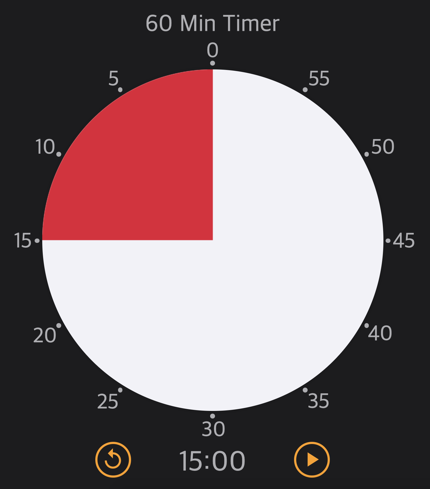

# Timer

[](https://app.netlify.com/sites/troytae-time-timer/deploys)

## Description

Web timer inspired by TIME TIMER

## Demo

  

Website: https://troytae-time-timer.netlify.app/  

## Installation

### Step1

Clone this repository
```
https://github.com/TroyTae/timer.git
```

### Step2

Install npm modules
*(If you are not install npm, do it first)*
```
npm install
```

### Step3

Run server with this command, then you can go to http://localhost:4200 in you browser.
```
npm run start
```
